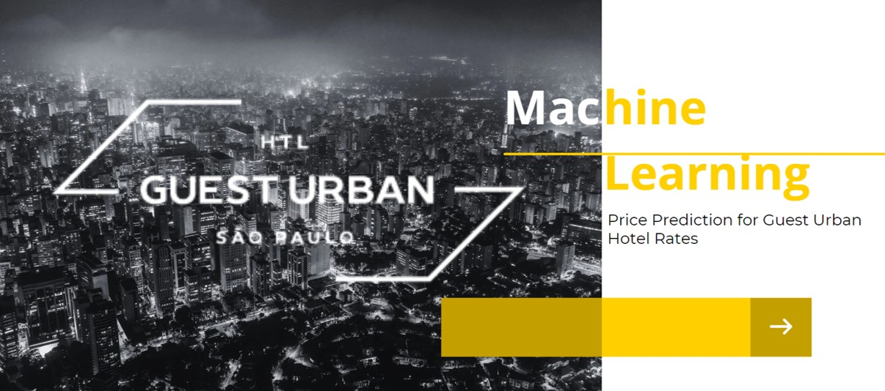

# Machine Learning From Scraping to Prediction
Price Prediction for Guest Urban Hotel Rates - Phyton | Selenium | Pandas | H20 | SQL | Power Bi

This project aims to solve a problem of Guest Urban Hotel (GUH), in São Paulo – Brazil. 
www.guesturbansp.com.br

After pandemic, market price of São Paulo hotel rates and occupancy rates has changed drastically. It has been difficult to apply with efficiency a well planned price strategy.
So let´s predict future prices for GUH’s rate based on various data sources, data mining techniques, and machine learning models.

# Project Overview

The goal of this project is to develop a machine learning model that can accurately predict future prices for the GUH rate. The project involves the following key steps:

1.Data Collection:
• Scraping data from Booking.com competitor set (10 hotels)
• Obtaining GUH data from Cloudbed PMS
• Gathering data based on GUH CEO knowledge or SP Tourism's Observatory data
2.Data Cleaning and Transformation:
• Preprocessing and transforming the collected data using Python
• Handling missing values, outliers, and data inconsistencies
• Feature engineering to create relevant variables
3.Feature Selection:
• Identifying the most relevant variables for price prediction
• Assessing the correlation and significance of each variable
4.Model Training and Selection:
• Using the H2O framework to train and test machine learning models
• Considering different algorithms, such as Distributed Random Forest (DRF)
• Evaluating and comparing the performance of the models
5.Predicting Future Prices:
• Applying the selected machine learning model to predict future prices for the GUH rate
• Assessing the accuracy and reliability of the predictions

# Repository Structure

https://github.com/DemianFigueiredo/MachineLearning_fromScrapingToPredict.git

The repository has the following structure:

- data/ - main 
data_h2o.csv  # main data set final to apply as train model
othes .cvs files available

- database/
SQL queries for DB creation of data_h2o table.
EER Diagram

- notebooks/
Scraping_Extranet_Booking.ipynb    
cleaning_process.ipynb 
treinamento_de_modelos_ml.ipynb
predict.ipynb

- visualisation/
Final presentation in PDF and link bellow
https://www.canva.com/design/DAFtxXIiMxg/ianhC8AO5l06tTtoxUVwLg/view?utm_content=DAFtxXIiMxg&utm_campaign=share_your_design&utm_medium=link&utm_source=shareyourdesignpanel
Graphics in Power Bi

# Conclusion
This project demonstrates the process of predicting future prices for the GUH rate using machine learning techniques. By leveraging data from various sources, conducting data cleaning and transformation, selecting relevant features, and training models, we can make accurate predictions for future hotel prices. The results of this project can be used to inform pricing strategies and optimize revenue for the GUH rate.

For more detailed information and insights, please refer to the individual notebooks in the GITHUB / directory.
For any questions or feedback, please contact Demian Figueiredo at demian.c.figueiredo@gmail.com

